# Database Schema Map

## Overview

The Moodle Homework Planner uses MongoDB as its database. This document provides a comprehensive map of all collections, their schemas, and relationships.

## Table of Contents
- [Collections Overview](#collections-overview)
- [Entity Relationship Diagram](#entity-relationship-diagram)
- [Detailed Schema Documentation](#detailed-schema-documentation)
  - [User](#user)
  - [Course](#course)
  - [Class](#class)
  - [Homework](#homework)
  - [StudentHomework](#studenthomework)
  - [Grade](#grade)
  - [Exam](#exam)
  - [StudyProgress](#studyprogress)
  - [Partner](#partner)
  - [RoleRequest](#rolerequest)
- [Relationship Summary](#relationship-summary)
- [Indexes](#indexes)

---

## Collections Overview

| Collection | Description | Key Relationships |
|------------|-------------|-------------------|
| **User** | Stores user accounts (students, lecturers, admins) | Referenced by most other collections |
| **Course** | Academic courses | Has many Classes, Homework, Exams; Belongs to Lecturer; Has many Students |
| **Class** | Individual class sessions | Belongs to Course |
| **Homework** | Homework assignments | Belongs to Course; Has many Grades, Partners |
| **StudentHomework** | Student-uploaded homework | Belongs to Course and User |
| **Grade** | Student grades for homework/exams | Belongs to Student, Homework or Exam |
| **Exam** | Examinations | Belongs to Course; Has many Grades |
| **StudyProgress** | Student study tracking | Belongs to Student (User) |
| **Partner** | Student partnerships for homework | Belongs to Homework and two Students |
| **RoleRequest** | Role change requests | Belongs to User |

---

## Entity Relationship Diagram

### Complete Database Schema Graph

```mermaid
graph TB
    %% Core Entities
    User[👤 User<br/>auth0_id, email, name<br/>role: student/lecturer/admin]
    Course[📚 Course<br/>course_name, course_code<br/>lecturer_id, students[]]
    Homework[📝 Homework<br/>title, description<br/>due_date, course_id]
    StudentHW[📋 StudentHomework<br/>title, claimed_deadline<br/>uploader_role, course_id]
    Grade[🎯 Grade<br/>student_id, homework_id<br/>completion_status, grade]
    Partner[🤝 Partner<br/>student1_id, student2_id<br/>homework_id, homework_type]
    
    %% Secondary Entities
    Class[🏫 Class<br/>class_title, class_date<br/>start_time, end_time]
    Exam[📊 Exam<br/>exam_title, due_date<br/>exam_type, course_id]
    StudyProgress[📈 StudyProgress<br/>date, hours_studied<br/>tasks_completed]
    RoleRequest[📋 RoleRequest<br/>desired_role, status<br/>user, note]
    
    %% User Relationships (One-to-Many)
    User -->|"teaches"| Course
    User -->|"receives"| Grade
    User -->|"tracks"| StudyProgress
    User -->|"submits"| RoleRequest
    User -->|"uploads"| StudentHW
    User -->|"student1"| Partner
    User -->|"student2"| Partner
    User -->|"graded by"| Grade
    
    %% Course Relationships (One-to-Many)
    Course -->|"has classes"| Class
    Course -->|"has homework"| Homework
    Course -->|"has exams"| Exam
    Course -->|"belongs to"| StudentHW
    
    %% Homework Relationships (One-to-Many)
    Homework -->|"graded"| Grade
    Homework -->|"allows partnerships"| Partner
    
    %% StudentHomework Relationships (One-to-Many)
    StudentHW -->|"graded"| Grade
    StudentHW -->|"allows partnerships"| Partner
    
    %% Exam Relationships (One-to-Many)
    Exam -->|"graded"| Grade
    
    %% Many-to-Many Relationships (Junction Tables)
    User -.->|"enrolled in<br/>(via Course.students[])"| Course
    User -.->|"grades homework<br/>(via Grade table)"| Homework
    User -.->|"grades student homework<br/>(via Grade table)"| StudentHW
    User -.->|"grades exams<br/>(via Grade table)"| Exam
    User -.->|"partners with<br/>(via Partner table)"| User
    
    %% Styling
    classDef coreEntity fill:#e1f5fe,stroke:#01579b,stroke-width:3px
    classDef secondaryEntity fill:#f3e5f5,stroke:#4a148c,stroke-width:2px
    classDef junctionEntity fill:#e8f5e8,stroke:#1b5e20,stroke-width:2px
    
    class User,Course,Homework,StudentHW coreEntity
    class Class,Exam,StudyProgress,RoleRequest secondaryEntity
    class Grade,Partner junctionEntity
```

### Simplified Relationship Overview

```mermaid
graph LR
    %% Core Flow
    subgraph "👥 Users"
        S[👨‍🎓 Student]
        L[👨‍🏫 Lecturer]
        A[👨‍💼 Admin]
    end
    
    subgraph "📚 Academic Structure"
        C[📖 Course]
        H[📝 Traditional Homework]
        SH[📋 Student Homework]
        E[📊 Exam]
        CL[🏫 Class]
    end
    
    subgraph "🎯 Tracking & Assessment"
        G[🎯 Grade]
        P[🤝 Partner]
        SP[📈 Study Progress]
    end
    
    subgraph "⚙️ System Management"
        RR[📋 Role Request]
    end
    
    %% Main relationships
    L -->|"teaches"| C
    S -->|"enrolled in"| C
    C -->|"contains"| H
    C -->|"contains"| SH
    C -->|"contains"| E
    C -->|"contains"| CL
    
    S -->|"uploads"| SH
    S -->|"receives grades for"| G
    H -->|"graded via"| G
    SH -->|"graded via"| G
    E -->|"graded via"| G
    
    S -->|"partners on"| P
    H -->|"enables"| P
    SH -->|"enables"| P
    
    S -->|"tracks"| SP
    S -->|"requests role change"| RR
    
    %% Styling
    classDef user fill:#bbdefb,stroke:#1976d2,stroke-width:2px
    classDef academic fill:#c8e6c9,stroke:#388e3c,stroke-width:2px
    classDef tracking fill:#fff3e0,stroke:#f57c00,stroke-width:2px
    classDef system fill:#fce4ec,stroke:#c2185b,stroke-width:2px
    
    class S,L,A user
    class C,H,SH,E,CL academic
    class G,P,SP tracking
    class RR system
```



---

## Detailed Schema Documentation

### User

**Collection:** `users`

**Purpose:** Stores all user accounts with Auth0 integration for authentication.

#### Schema Fields

| Field | Type | Required | Description |
|-------|------|----------|-------------|
| `_id` | ObjectId | Yes | MongoDB auto-generated ID |
| `auth0_id` | String | Yes | Unique Auth0 identifier |
| `email` | String | Yes | User email (unique) |
| `name` | String | No | Display name |
| `full_name` | String | No | Full legal name |
| `username` | String | No | Username (unique when present) |
| `role` | String | No | User role: 'student', 'lecturer', 'admin' |
| `picture` | String | No | Profile picture URL |
| `email_verified` | Boolean | No | Email verification status (default: false) |
| `is_active` | Boolean | No | Active status (default: true) |
| `last_login` | Date | No | Last login timestamp |
| `metadata` | Object | No | Additional metadata (default: {}) |
| `lastSynced` | Date | No | Last Auth0 sync timestamp |
| `createdAt` | Date | Auto | Creation timestamp |
| `updatedAt` | Date | Auto | Last update timestamp |

#### Relationships

- **One-to-Many with Course** (as lecturer): A user with role 'lecturer' can teach multiple courses
- **Many-to-Many with Course** (as student): Students can be enrolled in multiple courses
- **One-to-Many with Grade**: A user receives many grades
- **One-to-Many with StudyProgress**: A user tracks study progress over time
- **One-to-Many with RoleRequest**: A user can submit role change requests
- **One-to-Many with StudentHomework**: A user uploads student homework
- **One-to-Many with Partner**: A user can have multiple partnerships

#### Indexes

- `auth0_id` (unique)
- `email` (unique)
- `username` (unique, sparse)

---

### Course

**Collection:** `courses`

**Purpose:** Represents academic courses taught by lecturers and taken by students.

#### Schema Fields

| Field | Type | Required | Description |
|-------|------|----------|-------------|
| `_id` | ObjectId | Yes | MongoDB auto-generated ID |
| `course_name` | String | Yes | Name of the course |
| `lecturer_id` | ObjectId → User | Yes | Reference to the lecturer |
| `syllabus` | String | No | Course syllabus |
| `course_code` | String | No | Course code (uppercase) |
| `description` | String | No | Course description |
| `credits` | Number | No | Credit hours (1-10) |
| `semester` | String | No | Enum: 'fall', 'spring', 'summer', 'winter' |
| `year` | Number | No | Academic year (2020-2030) |
| `students` | [ObjectId] → User | No | Array of enrolled student IDs |
| `is_active` | Boolean | No | Course status (default: true) |
| `createdAt` | Date | Auto | Creation timestamp |
| `updatedAt` | Date | Auto | Last update timestamp |

#### Relationships

- **Many-to-One with User** (lecturer): Course belongs to one lecturer
- **Many-to-Many with User** (students): Course has many enrolled students
- **One-to-Many with Class**: Course has many class sessions
- **One-to-Many with Homework**: Course has many homework assignments
- **One-to-Many with Exam**: Course has many exams
- **One-to-Many with StudentHomework**: Course has student-uploaded homework

#### Virtual Fields

- `homework`: Virtual populate to Homework collection
- `classes`: Virtual populate to Class collection
- `exams`: Virtual populate to Exam collection

#### Indexes

- `lecturer_id`
- `course_name`
- `course_code`
- `students`

#### Instance Methods

- `addStudent(studentId)`: Add student to course
- `removeStudent(studentId)`: Remove student from course

#### Static Methods

- `findByLecturer(lecturerId)`: Find active courses by lecturer
- `findByStudent(studentId)`: Find active courses for student

---

### Class

**Collection:** `classes`

**Purpose:** Represents individual class sessions within a course.

#### Schema Fields

| Field | Type | Required | Description |
|-------|------|----------|-------------|
| `_id` | ObjectId | Yes | MongoDB auto-generated ID |
| `course_id` | ObjectId → Course | Yes | Reference to course |
| `room` | String | Yes | Room number/location |
| `class_title` | String | No | Title of the class session |
| `class_date` | Date | Yes | Date of the class |
| `start_time` | String | Yes | Start time (HH:MM format) |
| `end_time` | String | Yes | End time (HH:MM format) |
| `description` | String | No | Class description |
| `agenda` | String | No | Class agenda |
| `class_type` | String | No | Enum: 'lecture', 'lab', 'seminar', 'workshop', 'exam', 'other' |
| `attendance_required` | Boolean | No | Attendance mandatory (default: true) |
| `is_cancelled` | Boolean | No | Cancellation status (default: false) |
| `cancellation_reason` | String | No | Reason for cancellation |
| `is_online` | Boolean | No | Online class flag (default: false) |
| `meeting_link` | String | No | Online meeting link |
| `meeting_password` | String | No | Meeting password |
| `createdAt` | Date | Auto | Creation timestamp |
| `updatedAt` | Date | Auto | Last update timestamp |

#### Relationships

- **Many-to-One with Course**: Class belongs to one course

#### Indexes

- `course_id`
- `class_date`
- `room`
- Compound: `(course_id, class_date)`
- Compound: `(class_date, start_time)`

#### Instance Methods

- `isToday()`: Check if class is today
- `isUpcoming()`: Check if class is in the future
- `getDurationMinutes()`: Calculate class duration
- `cancel(reason)`: Cancel class with reason

#### Static Methods

- `findByCourse(courseId)`: Find all classes for a course
- `findUpcoming(days)`: Find upcoming classes within N days
- `findByRoom(room)`: Find classes by room
- `findToday()`: Find today's classes

---

### Homework

**Collection:** `homeworks`

**Purpose:** Represents homework assignments created by lecturers.

#### Schema Fields

| Field | Type | Required | Description |
|-------|------|----------|-------------|
| `_id` | ObjectId | Yes | MongoDB auto-generated ID |
| `course_id` | ObjectId → Course | Yes | Reference to course |
| `title` | String | Yes | Homework title |
| `description` | String | Yes | Homework description |
| `due_date` | Date | Yes | Due date |
| `assigned_date` | Date | No | Assignment date (default: now) |
| `is_active` | Boolean | No | Active status (default: true) |
| `allow_late_submission` | Boolean | No | Allow late submissions (default: false) |
| `allow_partners` | Boolean | No | Allow study partnerships (default: false) |
| `max_partners` | Number | No | Max partners allowed (fixed: 1) |
| `createdAt` | Date | Auto | Creation timestamp |
| `updatedAt` | Date | Auto | Last update timestamp |

#### Relationships

- **Many-to-One with Course**: Homework belongs to one course
- **One-to-Many with Grade**: Homework has many grades
- **One-to-Many with Partner**: Homework can have student partnerships

#### Virtual Fields

- `grades`: Virtual populate to Grade collection
- `partners`: Virtual populate to Partner collection

#### Indexes

- `course_id`
- `due_date`
- `assigned_date`

#### Instance Methods

- `isOverdue()`: Check if homework is overdue
- `daysUntilDue()`: Calculate days until due date

#### Static Methods

- `findUpcoming(days)`: Find homework due within N days
- `findByCourse(courseId)`: Find homework by course

---

### StudentHomework

**Collection:** `studenthomeworks`

**Purpose:** Student-uploaded homework with verification system for deadlines and grades.

#### Schema Fields

| Field | Type | Required | Description |
|-------|------|----------|-------------|
| `_id` | ObjectId | Yes | MongoDB auto-generated ID |
| `title` | String | Yes | Homework title |
| `description` | String | No | Homework description |
| `course_id` | ObjectId → Course | Yes | Reference to course |
| `uploaded_by` | ObjectId → User | Yes | Reference to uploader |
| `uploader_role` | String | Yes | Enum: 'student', 'lecturer' |
| `claimed_deadline` | Date | Yes | Deadline claimed by student |
| `verified_deadline` | Date | No | Verified deadline |
| `deadline_verification_status` | String | No | Enum: 'unverified', 'verified', 'rejected' |
| `deadline_verified_by` | ObjectId → User | No | Lecturer who verified |
| `deadline_verified_at` | Date | No | Verification timestamp |
| `deadline_verification_notes` | String | No | Verification notes |
| `completed_at` | Date | No | Completion timestamp |
| `allow_partners` | Boolean | No | Allow study partnerships (default: false) |
| `max_partners` | Number | No | Max partners allowed (fixed: 1) |
| `createdAt` | Date | Auto | Creation timestamp |
| `updatedAt` | Date | Auto | Last update timestamp |

#### Relationships

- **Many-to-One with Course**: Student homework belongs to one course
- **Many-to-One with User** (uploaded_by): Uploaded by one user
- **Many-to-One with User** (verified_by): Verified by one lecturer

#### Virtual Fields

- `days_until_deadline`: Calculated days until deadline
- `is_overdue`: Boolean indicating if overdue

#### Indexes

- `course_id`
- `uploaded_by`
- `claimed_deadline`
- `deadline_verification_status`

#### Static Methods

- `findByCourse(courseId)`: Find student homework by course
- `findPendingVerifications()`: Find homework pending verification

---

### Grade

**Collection:** `grades`

**Purpose:** Stores individual student progress and grades for homework and exams. Each student gets a Grade entry for every homework/exam they're enrolled in. This collection implements many-to-many relationships between Students and Homework/Exams.

#### Schema Fields

| Field | Type | Required | Description |
|-------|------|----------|-------------|
| `_id` | ObjectId | Yes | MongoDB auto-generated ID |
| `student_id` | ObjectId → User | Yes | Reference to student |
| `homework_id` | ObjectId → Homework/StudentHomework | No* | Reference to homework (nullable) |
| `exam_id` | ObjectId → Exam | No* | Reference to exam (nullable) |
| `homework_type` | String | No | Type: 'traditional' or 'student' |
| `completion_status` | String | No | Status: 'not_started', 'in_progress', 'completed', 'graded' (default: 'not_started') |
| `grade` | Number | No | Grade value (0-100) - only set when completion_status is 'graded' |
| `points_earned` | Number | No | Points earned (min: 0) |
| `letter_grade` | String | No | Letter grade: 'A+', 'A', 'A-', 'B+', etc. |
| `graded_by` | ObjectId → User | Yes | Reference to grader (student or lecturer) |
| `feedback` | String | No | Grading feedback |
| `submission_date` | Date | No | Submission date |
| `completed_at` | Date | No | Completion timestamp |
| `is_late` | Boolean | No | Late submission flag (default: false) |
| `graded_at` | Date | No | Grading timestamp (default: now) |
| `createdAt` | Date | Auto | Creation timestamp |
| `updatedAt` | Date | Auto | Last update timestamp |

*Note: Either `homework_id` or `exam_id` must be present (not both)

#### Relationships

- **Many-to-One with User** (student): Grade belongs to one student
- **Many-to-One with Homework/StudentHomework**: Grade may belong to one homework (traditional or student-created)
- **Many-to-One with Exam**: Grade may belong to one exam
- **Many-to-One with User** (grader): Grade assigned by one user (student or lecturer)

#### Validation Rules

- Pre-save validation ensures either `homework_id` or `exam_id` is present, but not both
- If `completion_status` is 'graded', then `grade` field is required
- `homework_type` must be 'traditional' or 'student' when `homework_id` is present

#### Indexes

- `student_id`
- `homework_id`
- `exam_id`
- `homework_type`
- `completion_status`
- `graded_by`
- `graded_at` (descending)
- Compound: `(student_id, homework_id)`
- Compound: `(student_id, exam_id)`
- Compound: `(student_id, homework_id, homework_type)`

#### Instance Methods

- `calculateLetterGrade()`: Calculate letter grade from numeric grade
- `isPassing()`: Check if grade is passing (≥60%)

#### Static Methods

- `findByStudent(studentId)`: Find all grades for a student
- `findByHomework(homeworkId, homeworkType)`: Find all grades for homework (traditional or student)
- `findByExam(examId)`: Find all grades for exam
- `getHomeworkAverage(homeworkId, homeworkType)`: Calculate average grade for homework
- `findByStatus(completionStatus)`: Find grades by completion status
- `findByStudentAndHomework(studentId, homeworkId, homeworkType)`: Find specific student's grade for homework

---

### Exam

**Collection:** `exams`

**Purpose:** Represents examinations within courses.

#### Schema Fields

| Field | Type | Required | Description |
|-------|------|----------|-------------|
| `_id` | ObjectId | Yes | MongoDB auto-generated ID |
| `course_id` | ObjectId → Course | Yes | Reference to course |
| `exam_title` | String | Yes | Exam title |
| `due_date` | Date | Yes | Exam date |
| `description` | String | No | Exam description |
| `instructions` | String | No | Exam instructions |
| `start_time` | String | Yes | Start time (HH:MM format) |
| `duration_minutes` | Number | Yes | Exam duration in minutes (min: 1) |
| `exam_type` | String | No | Enum: 'midterm', 'final', 'quiz', 'practical', 'oral', 'other' |
| `points_possible` | Number | No | Maximum points (min: 0, default: 100) |
| `room` | String | No | Exam room |
| `is_online` | Boolean | No | Online exam flag (default: false) |
| `meeting_link` | String | No | Online meeting link |
| `open_book` | Boolean | No | Open book exam (default: false) |
| `calculator_allowed` | Boolean | No | Calculator allowed (default: false) |
| `notes_allowed` | Boolean | No | Notes allowed (default: false) |
| `is_active` | Boolean | No | Active status (default: true) |
| `is_published` | Boolean | No | Published status (default: false) |
| `createdAt` | Date | Auto | Creation timestamp |
| `updatedAt` | Date | Auto | Last update timestamp |

#### Relationships

- **Many-to-One with Course**: Exam belongs to one course
- **One-to-Many with Grade**: Exam has many grades

#### Virtual Fields

- `grades`: Virtual populate to Grade collection

#### Indexes

- `course_id`
- `due_date`
- `exam_type`
- Compound: `(course_id, due_date)`

#### Instance Methods

- `isOverdue()`: Check if exam is overdue
- `daysUntilExam()`: Calculate days until exam
- `getEndTime()`: Calculate exam end time
- `isToday()`: Check if exam is today
- `publish()`: Publish exam to students

#### Static Methods

- `findByCourse(courseId)`: Find exams by course
- `findUpcoming(days)`: Find upcoming exams within N days
- `findByType(examType)`: Find exams by type
- `findToday()`: Find today's exams

---

### StudyProgress

**Collection:** `studyprogresses`

**Purpose:** Tracks student study sessions and progress over time.

#### Schema Fields

| Field | Type | Required | Description |
|-------|------|----------|-------------|
| `_id` | ObjectId | Yes | MongoDB auto-generated ID |
| `student_id` | ObjectId → User | Yes | Reference to student |
| `date` | Date | Yes | Study date |
| `hours_studied` | Number | Yes | Total hours studied (0-24) |
| `tasks_completed` | String | Yes | Description of completed tasks |
| `subjects_studied` | [Object] | No | Array of subjects with hours |
| `subjects_studied.subject` | String | No | Subject name |
| `subjects_studied.hours` | Number | No | Hours spent on subject |
| `study_sessions` | [Object] | No | Array of study sessions |
| `study_sessions.start_time` | String | Yes | Session start (HH:MM) |
| `study_sessions.end_time` | String | Yes | Session end (HH:MM) |
| `study_sessions.subject` | String | No | Subject studied |
| `study_sessions.notes` | String | No | Session notes |
| `study_sessions.productivity_rating` | Number | No | Rating (1-5) |
| `daily_goal_hours` | Number | No | Daily goal in hours (default: 0) |
| `goal_achieved` | Boolean | No | Goal achieved flag (default: false) |
| `focus_rating` | Number | No | Focus rating (1-5) |
| `difficulty_rating` | Number | No | Difficulty rating (1-5) |
| `month_summary` | String | No | Monthly summary text |
| `createdAt` | Date | Auto | Creation timestamp |
| `updatedAt` | Date | Auto | Last update timestamp |

#### Relationships

- **Many-to-One with User**: Study progress belongs to one student

#### Unique Constraint

- Compound unique index on `(student_id, date)` - one record per student per day

#### Indexes

- `student_id`
- `date`
- Compound unique: `(student_id, date)`
- Compound: `(student_id, date)` descending

#### Instance Methods

- `addStudySession(session)`: Add a study session
- `getWeekNumber()`: Get ISO week number
- `getMonthYear()`: Get month/year string

#### Static Methods

- `findByStudent(studentId)`: Find all study progress for student
- `findByDateRange(studentId, startDate, endDate)`: Find by date range
- `getWeeklySummary(studentId, weekStart)`: Aggregate weekly stats
- `getMonthlySummary(studentId, year, month)`: Aggregate monthly stats
- `getStudyStreak(studentId)`: Calculate consecutive study days

---

### Partner

**Collection:** `partners`

**Purpose:** Manages student partnerships for homework assignments.

#### Schema Fields

| Field | Type | Required | Description |
|-------|------|----------|-------------|
| `_id` | ObjectId | Yes | MongoDB auto-generated ID |
| `homework_id` | ObjectId | Yes | Reference to homework (Homework OR StudentHomework) |
| `homework_type` | String | No | Enum: 'traditional', 'student' (default: 'traditional') |
| `student1_id` | ObjectId → User | Yes | Reference to first student |
| `student2_id` | ObjectId → User | Yes | Reference to second student |
| `partnership_status` | String | No | Enum: 'pending', 'accepted', 'declined', 'active', 'completed' |
| `initiated_by` | ObjectId → User | Yes | Who initiated partnership |
| `notes` | String | No | Partnership notes |
| `accepted_at` | Date | No | Acceptance timestamp |
| `completed_at` | Date | No | Completion timestamp |
| `createdAt` | Date | Auto | Creation timestamp |
| `updatedAt` | Date | Auto | Last update timestamp |

#### Relationships

- **Polymorphic with Homework/StudentHomework**: Partnership can belong to either traditional Homework or StudentHomework (determined by `homework_type` field)
- **Many-to-One with User** (student1): First partner
- **Many-to-One with User** (student2): Second partner
- **Many-to-One with User** (initiator): User who initiated

#### Notes

- The `homework_id` field can reference either `Homework` or `StudentHomework` collection
- Use `homework_type` to determine which collection to query
- Manual population required (no automatic ref) to support both types

#### Validation Rules

- Pre-save validation ensures `student1_id` and `student2_id` are different

#### Unique Constraint

- Compound unique index on `(homework_id, student1_id, student2_id)`

#### Indexes

- `homework_id`
- `student1_id`
- `student2_id`
- Compound unique: `(homework_id, student1_id, student2_id)`

#### Instance Methods

- `getPartnerOf(studentId)`: Get the partner of a specific student
- `includesStudent(studentId)`: Check if student is in partnership
- `accept()`: Accept partnership
- `complete()`: Mark partnership as completed

#### Static Methods

- `findByHomework(homeworkId)`: Find partnerships for homework
- `findByStudent(studentId)`: Find all partnerships for student
- `findActiveByStudent(studentId)`: Find active partnerships for student
- `partnershipExists(homeworkId, student1Id, student2Id)`: Check if partnership exists

---

### RoleRequest

**Collection:** `rolerequests`

**Purpose:** Manages user requests to change their role in the system.

#### Schema Fields

| Field | Type | Required | Description |
|-------|------|----------|-------------|
| `_id` | ObjectId | Yes | MongoDB auto-generated ID |
| `user` | ObjectId → User | Yes | Reference to user |
| `desired_role` | String | Yes | Enum: 'student', 'lecturer', 'admin' |
| `status` | String | No | Enum: 'pending', 'approved', 'rejected' (default: 'pending') |
| `note` | String | No | Request note (default: '') |
| `created_at` | Date | No | Creation date (default: now) |
| `updated_at` | Date | No | Last update date (default: now) |

#### Relationships

- **Many-to-One with User**: Role request belongs to one user

#### Pre-save Hook

- Automatically updates `updated_at` field before saving

---

## Relationship Summary

### One-to-Many Relationships

| Parent | Child | Foreign Key | Description |
|--------|-------|-------------|-------------|
| User (lecturer) | Course | `lecturer_id` | Lecturer teaches courses |
| User | Grade | `student_id` | Student receives grades |
| User | StudyProgress | `student_id` | Student tracks progress |
| User | RoleRequest | `user` | User submits role requests |
| User | StudentHomework | `uploaded_by` | User uploads homework |
| Course | Class | `course_id` | Course has class sessions |
| Course | Homework | `course_id` | Course has homework |
| Course | Exam | `course_id` | Course has exams |
| Course | StudentHomework | `course_id` | Course has student homework |
| Homework | Grade | `homework_id` | Homework receives grades |
| Homework | Partner | `homework_id` | Homework allows partnerships |
| Exam | Grade | `exam_id` | Exam receives grades |

### Many-to-Many Relationships

| Entity 1 | Entity 2 | Junction/Implementation | Description |
|----------|----------|-------------------------|-------------|
| User (student) | Course | `Course.students` array | Students enrolled in courses |
| User | User | Partner collection | Students partner on homework |
| User (student) | Homework | Grade collection | Students have grades for homework |
| User (student) | StudentHomework | Grade collection | Students have grades for student-created homework |
| User (student) | Exam | Grade collection | Students have grades for exams |

### Polymorphic Relationships

| Child | Parents | Implementation | Description |
|-------|---------|----------------|-------------|
| Grade | Homework OR Exam | `homework_id` XOR `exam_id` | Grade belongs to either homework or exam |
| Grade | Homework OR StudentHomework | `homework_id` with `homework_type` | Grade can belong to traditional or student-created homework |
| Partner | Homework OR StudentHomework | `homework_id` with `homework_type` | Partnership can be for traditional or student-created homework |

### Many-to-Many Implementation Details

#### Student-Course Enrollment
- **Implementation**: Array field `students` in Course collection
- **Access Pattern**: `Course.students` contains array of User ObjectIds
- **Query Example**: `Course.find({ students: studentId })`

#### Student-Homework Grades  
- **Implementation**: Grade collection as junction table
- **Key Fields**: `student_id`, `homework_id`, `homework_type`
- **Access Pattern**: Each student gets one Grade entry per homework
- **Query Example**: `Grade.find({ student_id: studentId, homework_type: 'traditional' })`

#### Student Partnerships
- **Implementation**: Partner collection as junction table  
- **Key Fields**: `student1_id`, `student2_id`, `homework_id`, `homework_type`
- **Access Pattern**: Each partnership creates one Partner entry
- **Query Example**: `Partner.find({ $or: [{ student1_id: studentId }, { student2_id: studentId }] })`

---

## Indexes

### Performance Indexes

#### User Collection
- `auth0_id` (unique)
- `email` (unique)
- `username` (unique, sparse)

#### Course Collection
- `lecturer_id`
- `course_name`
- `course_code`
- `students`

#### Class Collection
- `course_id`
- `class_date`
- `room`
- Compound: `(course_id, class_date)`
- Compound: `(class_date, start_time)`

#### Homework Collection
- `course_id`
- `due_date`
- `assigned_date`

#### StudentHomework Collection
- `course_id`
- `uploaded_by`
- `claimed_deadline`
- `completion_status`
- `deadline_verification_status`
- `grade_verification_status`

#### Grade Collection
- `student_id`
- `homework_id`
- `exam_id`
- `graded_by`
- `graded_at` (descending)
- Compound: `(student_id, homework_id)`
- Compound: `(student_id, exam_id)`

#### Exam Collection
- `course_id`
- `due_date`
- `exam_type`
- Compound: `(course_id, due_date)`

#### StudyProgress Collection
- `student_id`
- `date`
- Compound unique: `(student_id, date)`
- Compound: `(student_id, date)` descending

#### Partner Collection
- `homework_id`
- `student1_id`
- `student2_id`
- Compound unique: `(homework_id, student1_id, student2_id)`

---

## Data Integrity Rules

### Unique Constraints
1. **User**: `auth0_id`, `email`, `username` (when present)
2. **StudyProgress**: `(student_id, date)` - one record per student per day
3. **Partner**: `(homework_id, student1_id, student2_id)` - unique partnerships

### Validation Rules
1. **Grade**: Must have either `homework_id` OR `exam_id`, not both
2. **Partner**: `student1_id` must differ from `student2_id`
3. **StudyProgress**: `hours_studied` must be between 0-24

### Cascading Behaviors
- **Soft Deletes**: Most collections use `is_active` flag instead of hard deletes
- **References**: No automatic cascading - application handles related record updates

---

## Database Statistics

| Collection | Estimated Avg Size | Growth Pattern |
|------------|-------------------|----------------|
| User | 1 KB per doc | Linear with users |
| Course | 2 KB per doc | Linear with courses |
| Class | 1 KB per doc | High volume (multiple per course) |
| Homework | 2 KB per doc | Medium volume |
| StudentHomework | 3 KB per doc | High volume |
| Grade | 1 KB per doc | Very high volume |
| Exam | 2 KB per doc | Low-medium volume |
| StudyProgress | 2 KB per doc | Very high volume (daily per student) |
| Partner | 0.5 KB per doc | Low-medium volume |
| RoleRequest | 0.5 KB per doc | Low volume |

---

## Notes

1. **Timestamps**: All collections use Mongoose `timestamps: true` for automatic `createdAt` and `updatedAt` fields
2. **Virtual Fields**: Many collections define virtual fields for relationships (populated on demand)
3. **Soft Deletes**: Most collections use `is_active` boolean flag instead of hard deletion
4. **Auth0 Integration**: User collection syncs with Auth0 via `auth0_id` and `lastSynced` fields
5. **Grade Submission**: Students self-report grades (lecturers only verify deadlines, not grades)
6. **Partner Limitations**: Maximum 1 partner per student (pairs only)

---

## Removed Fields (For Database Cleanup)

The following fields have been removed from the schema models and should be deleted from the actual MongoDB database:

### Course Collection (`courses`)
- ❌ `partner_settings.enabled`
- ❌ `partner_settings.max_partners_per_student`

**Reason:** Partner settings are now controlled at the homework level, not course level.

---

### Class Collection (`classes`)
- ❌ `max_capacity`

**Reason:** Class capacity tracking was not being utilized.

---

### Homework Collection (`homeworks`)
- ❌ `points_possible`
- ❌ `instructions`
- ❌ `submission_type`

**Reason:** These fields were defined but not actively used in the application.

**Note:** `max_partners` field was updated from range (1-5) to fixed value (1).

---

### StudentHomework Collection (`studenthomeworks`)
- ❌ `verified_grade`
- ❌ `grade_verification_status`
- ❌ `grade_verified_by`
- ❌ `grade_verified_at`
- ❌ `grade_screenshot_path`
- ❌ `extracted_grade_data` (object with: extracted_grade, extracted_total, confidence, raw_text)
- ❌ `tags` (array)
- ❌ `moodle_assignment_id`
- ❌ `moodle_url`
- ❌ `priority`
- ❌ `points_possible`
- ❌ `claimed_grade`
- ❌ `completion_status`

**Reason:** 
- Grade verification removed (students self-report grades, lecturers only verify deadlines)
- OCR/screenshot functionality not implemented
- Moodle integration not functional
- Tags not used for filtering
- Priority field was used in code but never defined in schema
- **NEW:** `claimed_grade` and `completion_status` moved to Grade table for proper many-to-many relationship

**Updated Fields:**
- `deadline_verification_status` enum updated from `['unverified', 'verified', 'rejected', 'pending_review']` to `['unverified', 'verified', 'rejected']` (removed 'pending_review')
- `max_partners` updated from range (1-5) to fixed value (1)

**Index Removed:**
- ❌ Index on `grade_verification_status`

---

### Grade Collection (`grades`)
- ❌ `is_final`
- ❌ `points_possible`

**Reason:** These fields were not being used in the grading workflow.

---

### MongoDB Cleanup Commands

To remove these fields from the actual database, run the following commands in MongoDB:

```javascript
// Course collection
db.courses.updateMany({}, { $unset: { 
  "partner_settings": "",
}});

// Class collection
db.classes.updateMany({}, { $unset: { 
  "max_capacity": "",
}});

// Homework collection
db.homeworks.updateMany({}, { $unset: { 
  "points_possible": "",
  "instructions": "",
  "submission_type": "",
}});

// StudentHomework collection
db.studenthomeworks.updateMany({}, { $unset: { 
  "verified_grade": "",
  "grade_verification_status": "",
  "grade_verified_by": "",
  "grade_verified_at": "",
  "grade_screenshot_path": "",
  "extracted_grade_data": "",
  "tags": "",
  "moodle_assignment_id": "",
  "moodle_url": "",
  "priority": "",
  "points_possible": "",
  "claimed_grade": "",
  "completion_status": "",
}});

// Grade collection
db.grades.updateMany({}, { $unset: { 
  "is_final": "",
  "points_possible": "",
}});

// Drop removed indexes
db.studenthomeworks.dropIndex("grade_verification_status_1");
```

**⚠️ Warning:** Always backup your database before running cleanup commands!

---


## Recent Major Changes (December 2024)

### Grade Table Restructure
- **NEW APPROACH**: Grade table now stores individual student progress for ALL homework (both traditional and student-created)
- **Many-to-Many Relationship**: Each student gets a Grade entry for every homework they're enrolled in
- **Completion Status Tracking**: Individual student progress tracked in Grade table with `completion_status` field
- **Partnership Grading**: When one student grades themselves, their partner's Grade entry is automatically updated
- **Removed Fields**: `claimed_grade` and `completion_status` removed from StudentHomework table
- **Added Fields**: `homework_type`, `completion_status`, `completed_at` added to Grade table

### Benefits
- Proper many-to-many relationship between students and homework
- Individual student progress tracking
- Simplified partnership grading logic
- Consistent data structure for both traditional and student-created homework

